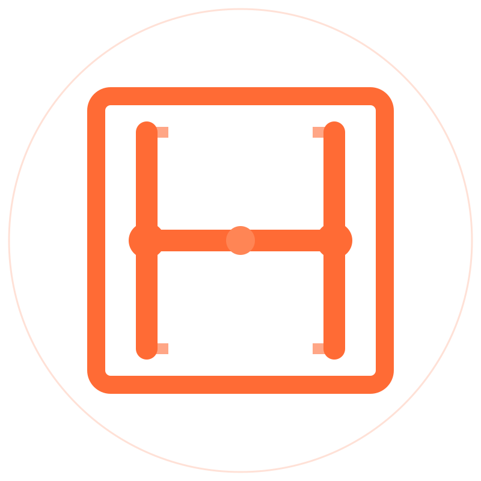

<picture>
  <source media="(prefers-color-scheme: dark)" srcset="assets/hdds-logo-dark-bg-800.png">
  
</picture>

# HDDS

**High-performance Data Distribution Service**

Pure-Rust DDS/RTPS middleware. Designed and built in France.

[Website](https://hdds.io) · [Core repository](https://github.com/hdds-team/hdds) · [Demos](https://github.com/hdds-team/hdds_packs) · Contact: [olivier@hdds.io](mailto:olivier@hdds.io)

---

## Interoperability, measured

HDDS does not claim compliance -- it is tested for it, continuously, against
every major DDS implementation in the official OMG interoperability campaigns.

- **OMG DDS-RTPS campaign** (continuous, snapshot of 2026-07-22): the only
  product at the maximum of both leaderboards -- perfect single-product score
  (**105/105**) and co-leading cross-product score (**1356/1505**), ahead of
  RTI Connext.
- **OMG DDS-XTypes campaign** (run of 2026-07-17): highest cross-vendor pass
  rate aggregated across the six report variants -- **82.5%** on an identical
  test perimeter (CoreDX 78.6%, Cyclone DDS 77.5%, RTI Connext 71.1%) -- and
  **100% self-conformance** (1799/1799).
- Officially registered RTPS vendor ID **`{0x01, 0x1A}`**
  ([DDS Foundation registry](https://www.dds-foundation.org/dds-rtps-vendor-and-product-ids/)).

The OMG campaigns are continuous and results move: figures above are dated
snapshots, verifiable in the public campaign reports.

## The stack

| Project | What it is |
|---------|------------|
| [hdds](https://github.com/hdds-team/hdds) | The middleware: DDS, RTPS, XTypes and DDS-Security in pure Rust. SDKs for C, C++, Python, Rust and TypeScript. Embedded targets (ESP32, seL4). ROS 2 support via `rmw_hdds`. |
| [hdds_gen](https://github.com/hdds-team/hdds_gen) | OMG IDL 4.2 parser and multi-backend code generator (Rust, C, C++, Python, TypeScript). |
| [hdds_packs](https://github.com/hdds-team/hdds_packs) | Self-contained demonstration projects, from air-defense radar to smart factory. |
| [HDDS Viewer](https://hdds.io) | Real-time DDS observability and capture-replay desktop tool (commercial). |
| [HDDS Studio](https://hdds.io) | Visual IDL editor with round-trip fidelity (commercial). |

## Also on this account

| Project | What it is |
|---------|------------|
| [devit](https://github.com/hdds-team/devit) | Security sandbox for AI coding agents: approval engine, HMAC-signed operations, immutable audit trail. |
| [aircp](https://github.com/hdds-team/aircp) | Real-time multi-agent AI collaboration, powered by HDDS. |
| [bitnet-arc](https://github.com/hdds-team/bitnet-arc) | BitNet ternary kernels on Intel Arc GPUs. |

---

HDDS is developed with an AI-assisted pipeline (architecture, code review,
quality guardrails, audit campaigns, CI) -- and validated by the
interoperability results above.

